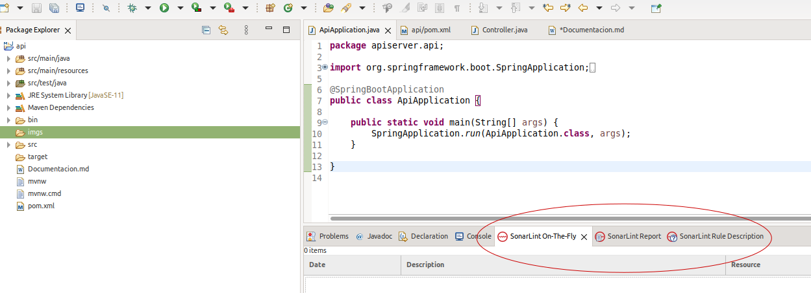

# Configuración SonarLint

1 - Dirigirse a Ayuda > marketplace -> buscar sonarLint

2 - una vez instalado reinicio del IDE

3 - Se ingresa al menu en la opcion window > show View > others 

4 - en la ventana emergente se busca sonarLint y se habilitan los las ventanas 
	* SonarLint On-The-Fly
	* SonarLint Report
	* SonarLint Rule Description
	

5 - Activar Análisis: para realizar analisis al código se procede a dar click derecho sobre el proyecto > SonarLint > Analizar

6 - Revission de resultados: los resultados se pueden visualizar en la ventana 
